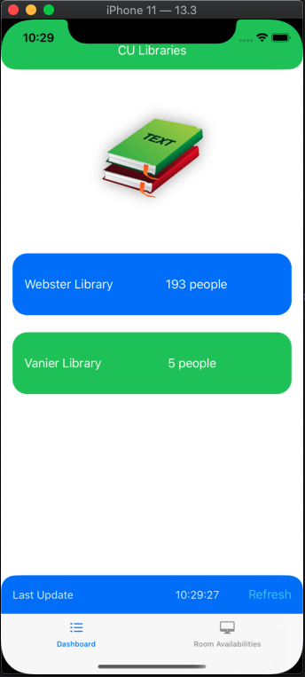
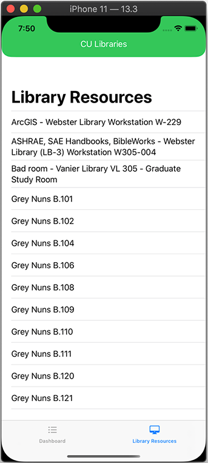

# CU Libraries

CULibraries is An iOS app to check the status of various resources at the Concordia University libraries in Montreal, Quebec. Built using SwiftUI and the [Concordia Open Data API](https://github.com/opendataConcordiaU/documentation).

CU Libraries is actively being developed and is in an alpha stage. Please refer to the [issues page](https://github.com/markjamesm/cu-libraries/issues) for a list of things which need sorting out.   

## Features

* Dark mode support 

## Planned

* Display library resource availabilities for a given time.

## Screenshots

     
